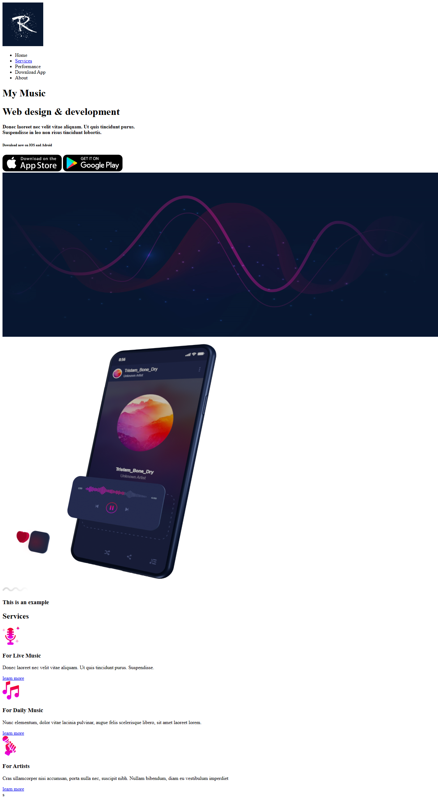

<h1>Taller 9: SEBASTIAN GODOY SEPULVEDA </h1>

<h2>Informacion</h2>

Curso: Full Stack Basico - Grupo 4

Profesor: Stive Verdugo
 

<h2>Link pagina Web</h2>
<a href="https://github.com/sebasdgs96/fullstackfrontend.git"> Link pagina Web</a>    

<h2>Punto 1-3: HTML</h2>
    

<h2>Punto 4: TITULOS</h2>
  

<h2>Punto 5 ESTILOS DE TEXTO</h2>
  

<h2>Punto 6 ENLACES</h2>
 

<h2>Punto 7 y 8 NAVEGACION</h2>
  

<h2>Punto 9 TABLAS</h2>
 

<h2>Punto 10</h2>
 

<h2>Punto 11</h2>
  

<h2>Punto 12</h2>
 